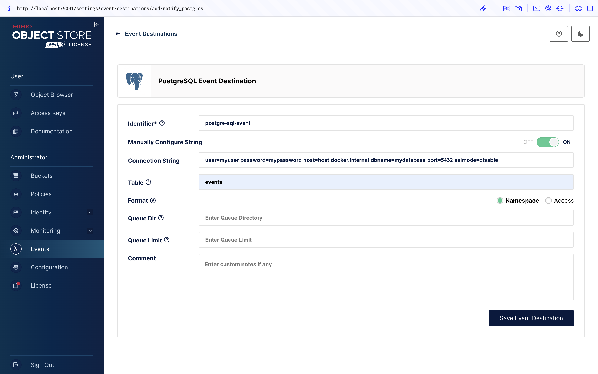
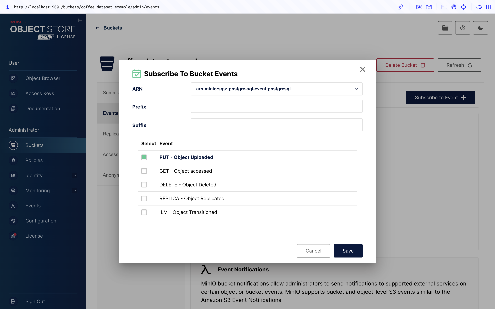
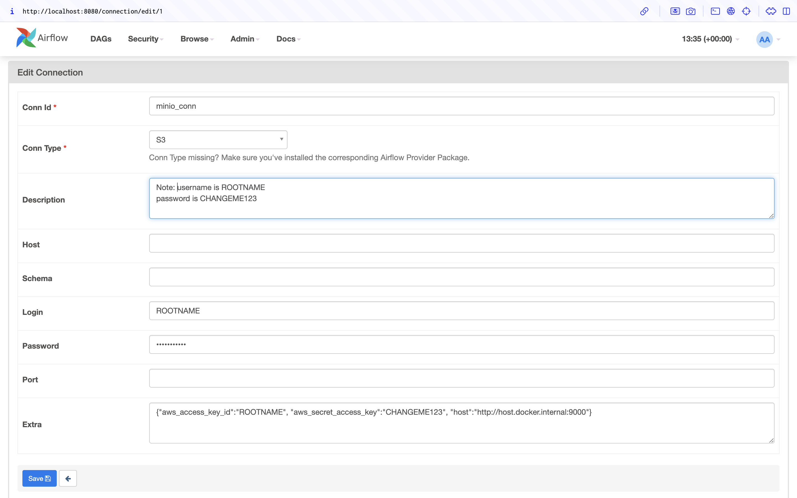
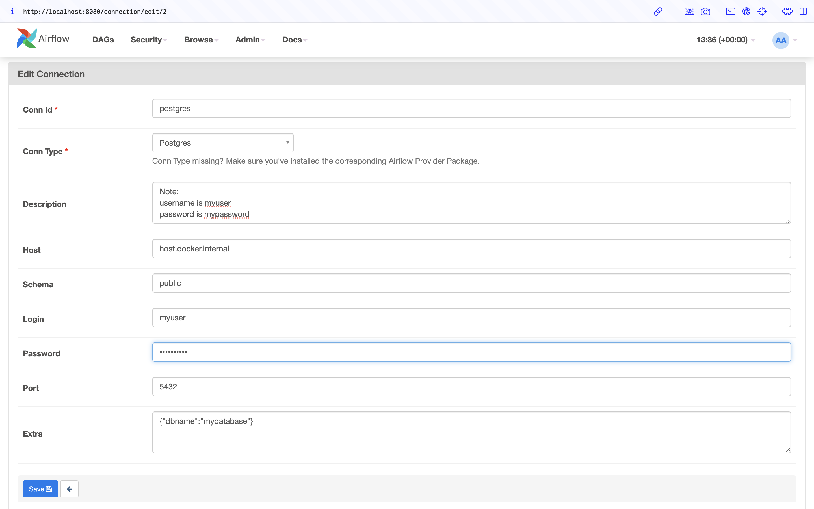
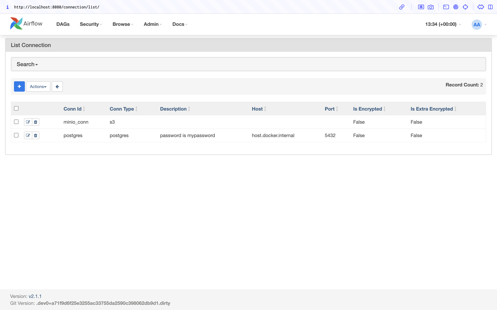
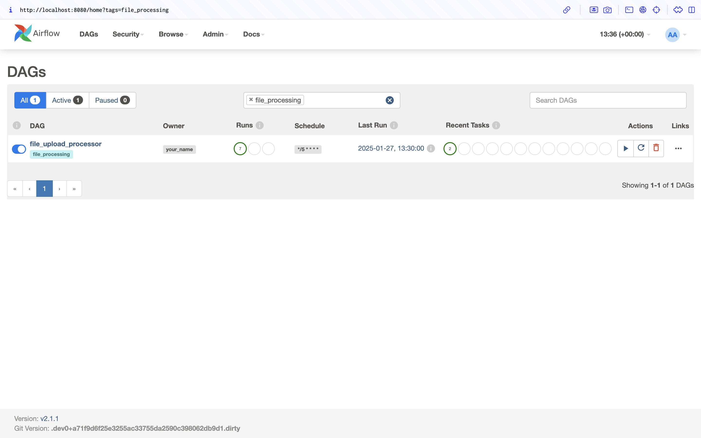
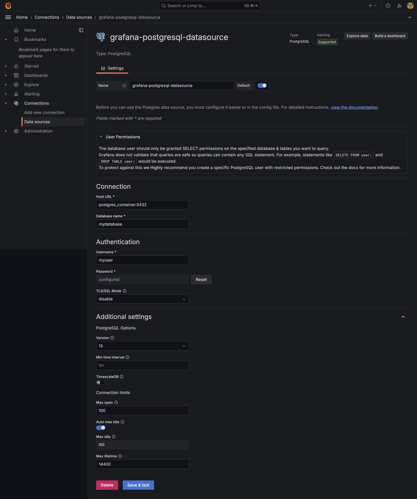

# ETL Pipeline with Coffee Data

## Overview

This project showcases an ETL (Extract, Transform, Load) pipeline that integrates a MinIO S3 bucket for file ingestion, processes uploaded files, and stores the data in a PostgreSQL database. The entire system is containerized using Docker and features Grafana for visualization. Airflow is used to orchestrate the pipeline.

## Coffee Dataset

To provide a useful example of an ETL pipeline, this project utilizes a coffee dataset that includes [historical data](https://www.kaggle.com/datasets/michals22/coffee-dataset) on coffee production by country, providing insights into global coffee trends. Additionally, the pipeline is able to process data that tracks [the evolution of coffee prices over time](https://www.kaggle.com/datasets/timmofeyy/coffee-prices-historical-data), allowing for comprehensive analysis and visualization of the coffee market dynamics.

## Prerequisites
- Docker [(Check installation wiki)](https://docs.docker.com/engine/install/)

## Project Structure
The project is divided into two Docker Compose stacks:

1. Main stack: Includes MinIO, Grafana, a Python script to initialize the system, and the PostgreSQL database.
2. Airflow stack: Contains Airflow and its internal services for orchestration.


## Instructions

1. **Clone the repository:**
   ```bash
   git clone https://github.com/zemendes1/ETL-Pipeline-Coffee-Data.git
   ```

2. **Build and Run the Main Stack:**
   
   Build and start the main services (MinIO, PostgreSQL, and Grafana):
   ```bash
   docker compose build
   docker compose up
   ```

3. **Build and run the application:**

   Navigate to the Airflow directory, set up its environment, and start the services:

   ```bash
   cd Airflow
   mkdir -p ./dags ./logs ./plugins ./config
   echo -e "AIRFLOW_UID=$(id -u)" > .env
   docker compose up airflow-init
   docker compose up
   ```

   **_NOTE:_** If using a platform other than linux/amd64, you may need to modify docker-compose.yml to match your architecture. Refer to Airflow's [official documentation for details](https://airflow.apache.org/docs/apache-airflow/stable/howto/docker-compose/index.html).


4. **Configure MinIO:**

   1. Access the MinIO Web UI, which should be located at http://127.0.0.1:9001/.

   2. Log in with default credentials (username: ROOTNAME, password: CHANGEME123).

   3. Create an S3 bucket named coffee-dataset-example.

   4. Set up an event notification to send data to the PostgreSQL database.


   
   *Figure 1: Setting up an event destination from MinIO to PostgreSQL.*

   
   *Figure 2: Configuring event notifications for file uploads.*

   5. Upload example files (Coffee_production.csv and Coffee_domestic_consumption.csv) in the folder "Example-CSV-Files/Test-Data" to the bucket.

   6. Restart the Docker services and verify that data has been ingested into the database tables coffee_production and coffee_domestic_consumption.

5. **Configure Airflow:**
   1. Access the Airflow Web UI, which should be located at http://127.0.0.1:8080/.

   2. Log in with default credentials (username: airflow, password: airflow).

   3. Create connections to the following:

   - MinIO S3 bucket
   -  PostgreSQL database

   
   *Figure 3: Connection setup from Airflow to MinIO.*

   
   *Figure 4: Connection setup from Airflow to PostgreSQL.*

   
   *Figure 5: Connections overview in Airflow.*

   4. Enable the DAG file_upload_processor in the Airflow dashboard. This DAG runs every 5 minutes to monitor new file uploads.

   
   *Figure 6: Activated DAG in Airflow.*

6. **Configure Grafana:**
   Lastly, we can create a simple dashboard in Grafana to proudly display our ETL and testing data.

   1. Access the Grafana Web UI, which should be located at http://127.0.0.1:3111/.

   2. Create a data source connection to the PostgreSQL database.
   
   
   *Figure 7: Connecting Grafana to PostgreSQL.*

   3. Design a dashboard to visualize your ETL pipeline data. Refer to the dashboard folder in this repository for examples.

   
   *Figure 8: Example Grafana dashboard.*

## Key Features
- **MinIO S3 Bucket**: Manages file uploads and triggers notifications.
- **Airflow DAG**: Automates ETL processing.
- **PostgreSQL Database**: Stores transformed data.
- **Grafana**: Visualizes pipeline performance and data insights.

## Troubleshooting
- Ensure Docker is installed and running correctly.
- Verify all services are accessible at the specified URLs.
- Review the logs (./logs) for detailed error information.

## Contributions
Feel free to fork this repository and submit pull requests. Contributions are welcome!

## License
This project is licensed under the [MIT License](https://opensource.org/license/mit).


