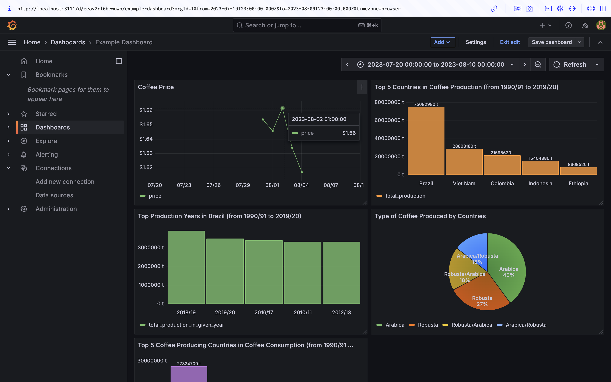

# Tech-Stack-Demonstration

## Overview
This project demonstrates a Python application that interacts with an S3 bucket and a PostgreSQL database. The application is containerized using Docker and integrates with Grafana for visualization purposes.

## Features
- Connects to a PostgreSQL database.
- Uploads and downloads files to/from MinIo S3.
- Uses Docker for containerization.
- Pre-commit hooks for code quality checks.

## Prerequisites
- Docker
- Docker Compose

## Setup Instructions

1. **Clone the repository:**
   ```bash
   git clone <repository-url>
   cd <repository-directory>
   ```

2. **Create a `.env` file:**
   Edit the `.env` file in the root directory of the project to store your AWS credentials:
   ```env
   AWS_ACCESS_KEY_ID=your_access_key
   AWS_SECRET_ACCESS_KEY=your_secret_key
   S3_BUCKET=your_s3_bucket
   ```

3. **Build and run the application:**
   Use Docker Compose to build and run the application:
   ```bash
   docker-compose up --build
   ```

4. **Access the application:**
   The application will run and execute the `main.py` script, which includes downloading a file from S3.

## Usage
- The application connects to a PostgreSQL database running in a Docker container.
- It downloads a specified file from an S3 bucket and saves it locally.

## Demonstration


*Figure 1: Docker containerization of all services.*


*Figure 2: Database inspection using dBeaver.*


*Figure 3: Grafana monitoring dashboard displaying application metrics.*